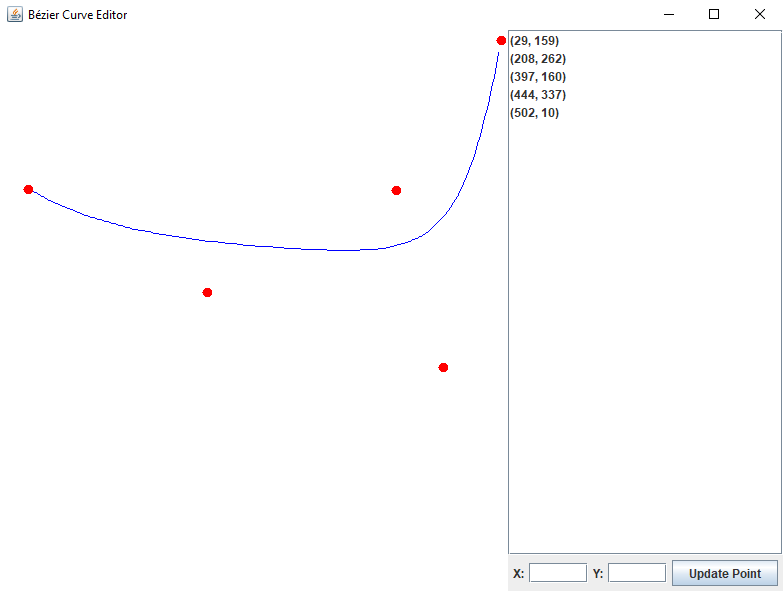
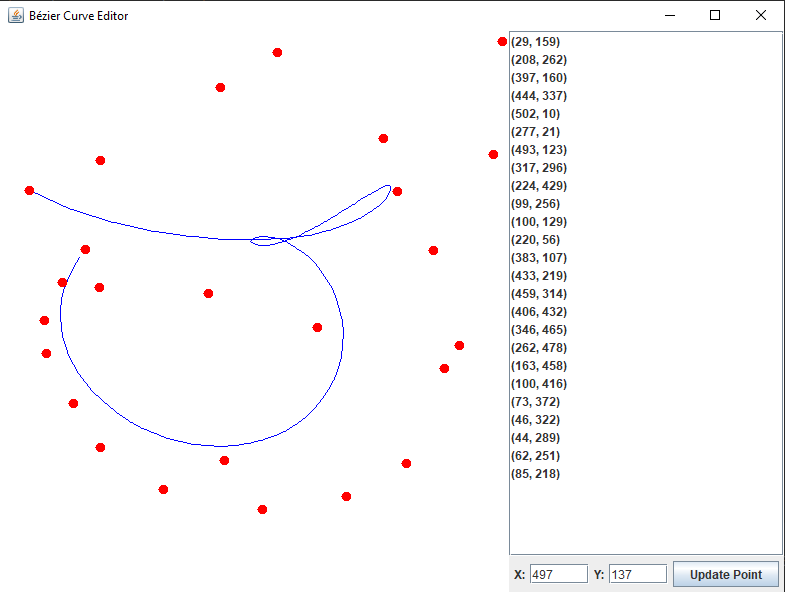

# Simple JAVA program build for data visualisation - in this case the Bézier curve with n points.

#
### Points are inserted through mouse clicks, and can be moved by dragging, but can also have their coordinates modified through an input box.

#
